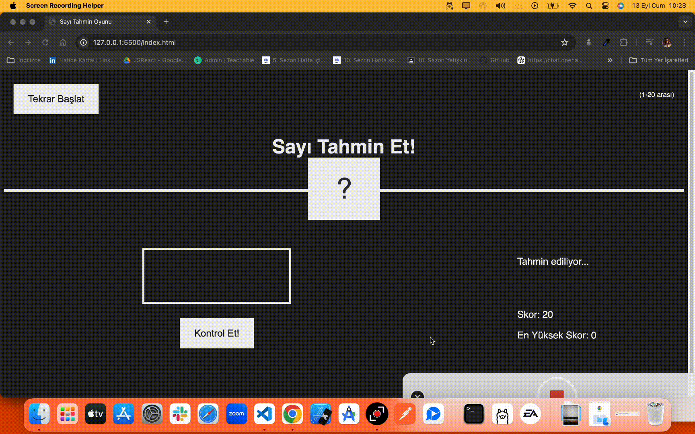

# Sayı Tahmin Oyunu
Bu proje, kullanıcıların bilgisayarın rastgele seçtiği bir sayıyı tahmin etmeye çalıştığı basit bir sayı tahmin oyunudur.

## Özellikler
- Rastgele sayı oluşturma
- Kullanıcı tahmini ile bilgisayar yanıtları
- Basit ve kullanıcı dostu arayüz

## Kullanılan Teknolojiler
- HTML
- CSS
- JavaScript

## GIF

